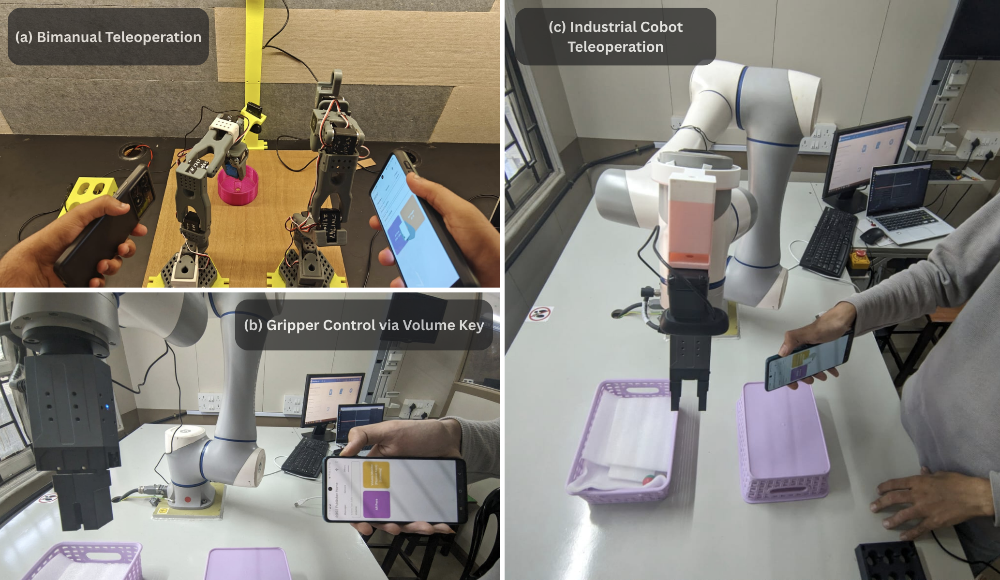
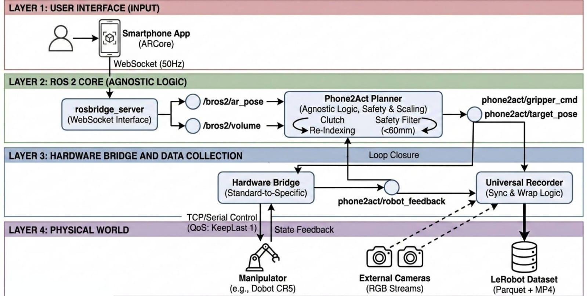
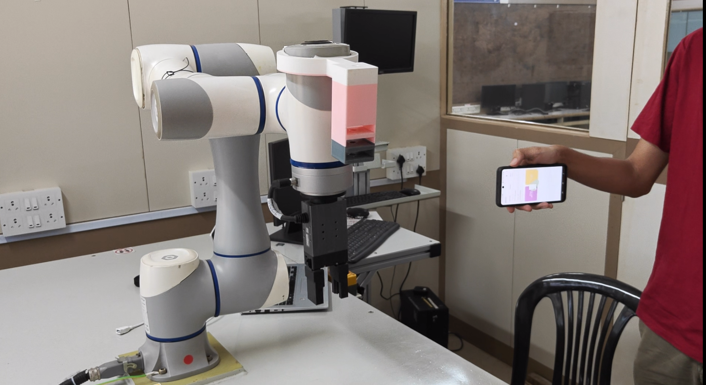

<div align="center">



# Phone2Act

### A Low-Cost, Hardware-Agnostic Teleoperation System for Scalable VLA Data Collection

<p align="center">
  <a href="https://arxiv.org/abs/XXXX.XXXXX"></a>
  &nbsp;
  <a href="https://phone2act.github.io"></a>
  &nbsp;
  <a href="https://github.com/OmMandhane/Phone2Act/releases"></a>
  &nbsp;
  <a href="LICENSE"></a>
</p>

<p align="center">
  <b>Om Mandhane* · Bipin Yadav* · Sangeetha Prasanna Ram · Gopalakrishnan Narayanan</b><br>
  <i>Vivekanand Education Society's Institute of Technology (VESIT), Mumbai</i><br>
  <small>* Equal contribution</small>
</p>

---

<table>
  <tr>
    <td align="center" width="33%">
      <br/>
      <b>Industrial Cobot (Dobot CR5)</b>
    </td>
    <td align="center" width="33%">
      <br/>
      <b>LeRobot SO-101</b>
    </td>
    <td align="center" width="33%">
      <br/>
      <b>GR00T-N1.5 Autonomous Policy</b>
    </td>
  </tr>
</table>

</div>

---

## 📖 Overview

Collecting diverse, high-quality manipulation data for Vision-Language-Action (VLA) model training remains prohibitively expensive for many research groups, as existing teleoperation frameworks rely on specialized hardware or are tightly coupled to specific robot platforms.

**Phone2Act** transforms a commodity Android smartphone into a **6-DoF robot controller** via Google ARCore. Built on a modular ROS 2 architecture, it decouples control logic from hardware specifics through interchangeable bridge nodes — supporting platforms from industrial cobots to low-cost bimanual arms **without any code modification**.

A **Universal Recorder** synchronizes multi-camera RGB streams with robot state feedback and exports demonstrations natively in the **LeRobot dataset format**, eliminating post-processing and enabling immediate VLA fine-tuning.

We validate the framework by fine-tuning **GR00T-N1.5** on 130 collected episodes, achieving a **90% success rate** on a real-world multi-stage pick-and-place task on a physical Dobot CR5.

### ✨ Key Features

| Feature | Description |
|---|---|
| 📱 **Smartphone controller** | Uses any ARCore-compatible Android phone as a 6-DoF input device |
| 🤖 **Hardware-agnostic** | Swap bridge nodes to support any robot — no core code changes |
| 🎬 **Universal Recorder** | Natively exports synchronized episodes in LeRobot (Parquet + MP4) format |
| 🔀 **Bimanual support** | Run two independent controller instances via ROS 2 namespaces |
| 🛡️ **Built-in safety** | Workspace clamping, zero-jump filter, and clutching for unlimited virtual workspace |
| 🚀 **VLA-ready** | Data collected at 50Hz, immediately compatible with GR00T, OpenVLA, Octo pipelines |

---

## 🏗️ System Architecture

<div align="center">
  
</div>

Phone2Act is organized into three layers that communicate exclusively via standardized ROS 2 topics, so any component can be swapped without modifying the others:

**Layer 1 — Interface (Smartphone):** A custom Android app uses Google ARCore to estimate 6-DoF pose at 50Hz, publishing to a rosbridge WebSocket server. Volume keys serve as intuitive binary inputs for clutch and gripper control.

**Layer 2 — Agnostic Core (Planner):** The central `phone2act_planner` node transforms raw phone pose into robot-independent Cartesian target poses. It handles spatial mapping, floating-zero clutching, workspace clamping, and zero-jump safety filtering — knowing nothing about the downstream robot.

**Layer 3 — Hardware Bridge & Data Collection:** Interchangeable bridge nodes translate standardized commands to robot-specific protocols. The Universal Recorder listens to standard topics and exports synchronized demonstration episodes directly in LeRobot format.

---

## 📦 Installation

### Prerequisites

- Ubuntu 22.04 (ROS 2 Humble) or Ubuntu 24.04 (ROS 2 Jazzy)
- Python 3.10+
- An ARCore-compatible Android smartphone

### 1. Clone the Repository

```bash
cd ~/ros2_ws/src
git clone https://github.com/OmMandhane/Phone2Act.git
cd Phone2Act
```

### 2. Install Dependencies

```bash
pip install -r requirements.txt
```

### 3. Build ROS 2 Packages

```bash
cd ~/ros2_ws
colcon build --packages-select phone2act_core phone2act_dobot phone2act_lerobot
source install/setup.bash
```

### 4. Install the Android App

1. Download **`phone2act.apk`** from the [Releases](https://github.com/OmMandhane/Phone2Act/releases) page
2. On your Android device, enable **Unknown Sources** (Settings → Security → Install Unknown Apps)
3. Install and open the app

---

## 📱 Phone App & How to Hold the Phone

<div align="center">
  
  &nbsp;&nbsp;
  
</div>

### Connecting to ROS

1. On your laptop, find your IP address: `hostname -I`
2. Launch the ROS bridge: `ros2 launch rosbridge_server rosbridge_websocket_launch.xml`
3. Open the Phone2Act app. Set the **AR Pose Topic** to `/Phone2Act/ar_pose` and the **Volume Topic** to `/Phone2Act/volume`
4. Enter your laptop's IP and tap **Connect**
5. Tap **Publish AR Pose** and **Publish Volume** buttons in the app to start streaming
6. Now launch the robot-specific nodes on your laptop (see sections below)

### Controls

| Input | Action |
|---|---|
| **Move phone** | Translates/rotates robot end-effector |
| **Volume Up** | Engage **clutch** — robot holds position, phone can be freely repositioned |
| **Volume Down** | Toggle **gripper** open/close |
| **Release Volume Up** | Disengage clutch — resumes teleoperation from new reference origin |

### How to Hold the Phone

<div align="center">
  
</div>

Hold the phone in one hand, pointed toward the robot's workspace, as shown above. Move your hand naturally — the ARCore pose tracker handles the rest. Use the **clutch** (Volume Up) any time you need to reposition your hand; the robot holds its position and re-indexes when you release.

**Tips for smooth teleoperation:**
- Press clutch once from a comfortable resting position to set the origin
- Use slow, deliberate movements — smaller motions give finer control
- Use the clutch freely; it prevents fatigue and there is no cost to re-indexing
- Keep the phone camera unobstructed for stable ARCore tracking

---

## 🤖 Teleoperation Setup by Robot

### Option A: Dobot CR Series (CR-3, CR-5, CR-10)

<div align="center">
  
</div>

```bash
# Terminal 1: ROS bridge + connect phone app (see Phone App section above)
ros2 launch rosbridge_server rosbridge_websocket_launch.xml

# Terminal 2: Dobot ROS 2 driver
ros2 launch cr_robot_ros2 dobot_bringup_ros2.launch.py

# Terminal 3: Dobot hardware bridge
ros2 run dobot_hardware_bridge dobot_hardware_bridge

# Terminal 4: Phone2Act planner
ros2 run phone2act_core phone2act_teleop_planner \
  --ros-args --params-file src/phone2act_core/config/dobot.yaml
```

The Dobot bridge communicates with the robot over TCP, converts meter-scale quaternion commands into the millimeter/Euler-degree format expected by the CR real-time port, and publishes state feedback at 50Hz.

**Configuration** (`src/phone2act_core/config/dobot.yaml`):

```yaml
phone2act_planner:
  ros__parameters:
    scale_pos: 800.0
    scale_rot: 1.0
    safe_limit_jump: 60.0      # Drops jumps > 60mm (anomaly filter)
    cmd_rate_hz: 30.0
    limits.x: [-800.0, 800.0]
    limits.y: [-800.0, 800.0]
    limits.z: [-800.0, 800.0]
    mapping.position.x: "+x"
    mapping.position.y: "+y"
    mapping.position.z: "+z"
```

---

### Option B: LeRobot SO-100 / SO-101

<div align="center">
  
</div>

```bash
# Terminal 1: ROS bridge + connect phone app (see Phone App section above)
ros2 launch rosbridge_server rosbridge_websocket_launch.xml

# Terminal 2: LeRobot hardware bridge
ros2 run phone2act_lerobot lerobot_hardware_bridge

# Terminal 3: Phone2Act planner
ros2 run phone2act_core phone2act_teleop_planner \
  --ros-args --params-file src/phone2act_core/config/lerobot.yaml
```

The LeRobot bridge connects to the servo bus over USB, performs real-time IK at 45Hz, and reads joint positions for pose feedback.

**Configuration** (`src/phone2act_core/config/lerobot.yaml`):

```yaml
phone2act_planner:
  ros__parameters:
    scale_pos: 800.0
    safe_limit_jump: 40.0      # More conservative for lighter arm
    cmd_rate_hz: 20.0          # Servo bus runs slower
    limits.x: [-800.0, 800.0]
    limits.y: [-800.0, 800.0]
    limits.z: [-800.0, 800.0]
    mapping.position.x: "-x"
    mapping.position.y: "+z"
    mapping.position.z: "+y"
```

For a custom USB port:

```bash
ros2 run phone2act_lerobot lerobot_hardware_bridge \
  --ros-args -p usb_port:=/dev/ttyUSB0
```

#### Bimanual Setup

Scaling to a dual-arm configuration requires **zero modifications** to the core source code. A standard launch file spins up two instances in isolated ROS 2 namespaces:

```bash
ros2 launch phone2act_lerobot bimanual.launch.py
```

In the app, assign one phone to publish to `/left/bros2/ar_pose` and the other to `/right/bros2/ar_pose`. Both data streams remain perfectly distinct.

---

### Option C: Custom Robot

Use the provided template to integrate any manipulator in minutes.

#### 1. Copy and configure the bridge template

```bash
cp src/phone2act_core/phone2act_core/template_hardware_bridge.py \
   src/phone2act_core/phone2act_core/my_robot_hardware_bridge.py
```

Implement these four methods:

```python
class MyRobotBridge(Node):
    def connect_hardware(self):
        # Connect via serial, TCP, ROS services, etc.

    def cb_target(self, msg):
        # Receive PoseStamped, solve IK, send joint commands

    def loop_feedback(self):
        # Read joints, compute FK, publish PoseStamped feedback
```

#### 2. Create a YAML config

```bash
cp src/phone2act_core/config/template.yaml \
   src/phone2act_core/config/my_robot.yaml
```

Key parameters to set:

```yaml
phone2act_planner:
  ros__parameters:
    scale_pos: 800.0              # Motion sensitivity (higher = faster)
    scale_rot: 1.0
    safe_limit_jump: 100.0        # Max jump (mm) before rejection
    cmd_rate_hz: 30.0

    limits.x: [-800.0, 800.0]    # Safe Cartesian workspace (mm)
    limits.y: [-800.0, 800.0]
    limits.z: [-800.0, 800.0]

    # Map phone axes → robot axes (sign flips invert direction)
    mapping.position.x: "+x"
    mapping.position.y: "+y"
    mapping.position.z: "+z"
    mapping.rotation.rx: "+roll"
    mapping.rotation.ry: "+pitch"
    mapping.rotation.rz: "+yaw"
```

#### 3. Launch

```bash
# Terminal 1: ROS bridge + connect phone app (see Phone App section above)
ros2 launch rosbridge_server rosbridge_websocket_launch.xml

# Terminal 2: Your hardware bridge
ros2 run your_package my_robot_hardware_bridge

# Terminal 3: Planner
ros2 run phone2act_core phone2act_teleop_planner \
  --ros-args --params-file src/phone2act_core/config/my_robot.yaml
```

---

## 🎬 VLA Data Collection (Universal Recorder)

The Universal Recorder captures synchronized RGB frames and robot state feedback at 20Hz, then exports directly to the **LeRobot dataset format** (Parquet + MP4) — no post-processing required.

To start recording:

```bash
ros2 run phone2act_core phone2act_universal_recorder \
  --ros-args -p output_dir:=/path/to/dataset
```

Each episode is saved with:
- **Observation**: proprioceptive joint positions, Cartesian end-effector pose, gripper state
- **Action**: 6-DoF Cartesian deltas + target gripper state
- **Video**: synchronized RGB streams from external cameras

The recorded data is immediately ready for VLA fine-tuning with frameworks such as GR00T, OpenVLA, or Octo.

### Results: GR00T-N1.5 Fine-tuning

<div align="center">
  
</div>

We collected **130 episodes** on a Dobot CR5 for a multi-stage pick-and-place task, averaging **2–3 episodes per minute**. Fine-tuning GR00T-N1.5-3B on a single NVIDIA RTX A6000 for 2,000 steps achieved:

| Metric | Value |
|---|---|
| Real-world trials | 10 |
| Successful executions | 9 / 10 |
| **Success rate** | **90%** |
| Training loss (MSE) at convergence | ~0.05 |

---

## ⚙️ Configuration Reference

### Position Mapping

| Phone Axis | Motion |
|---|---|
| `x` | Side-to-side tilt |
| `y` | Forward-backward tilt |
| `z` | Up-down motion |

Prefix with `+` or `-` to control direction. Example: `mapping.position.x: "-z"` maps robot X to the *negative* of phone Z.

### Safety Parameters

| Parameter | Default | Description |
|---|---|---|
| `scale_pos` | 800.0 | Position sensitivity — higher is faster |
| `scale_rot` | 1.0 | Rotation sensitivity |
| `safe_limit_jump` | 60.0 mm | Jump threshold; larger discontinuities are silently dropped |
| `cmd_rate_hz` | 30.0 Hz | Command publish rate |

---

## 🐛 Troubleshooting

**App can't connect**
```bash
hostname -I                              # Confirm laptop IP
ros2 topic list | grep bros2            # Confirm rosbridge is publishing
sudo ufw allow 9090                     # Open port if firewall is active
```

**Robot doesn't move**
```bash
ros2 topic echo /phone2act/target_pose  # Verify planner is publishing
ros2 node list                          # Confirm all nodes are running
```

**Jerky or unsafe motion** — Reduce `scale_pos`, increase `safe_limit_jump`, or use more deliberate phone movements.

**IK failures** — Verify `limits.x/y/z` covers your robot's actual workspace and that your URDF is correct.

---

## 📄 Citation

If you use Phone2Act in your research, please cite:

```bibtex
@article{mandhane2025phone2act,
  title   = {Phone2Act: A Low-Cost, Hardware-Agnostic Teleoperation System for Scalable VLA Data Collection},
  author  = {Mandhane, Om and Yadav, Bipin and Prasanna Ram, Sangeetha and Narayanan, Gopalakrishnan},
  journal = {arXiv preprint arXiv:XXXX.XXXXX},
  year    = {2025}
}
```

---

## 🤝 Contributing

We welcome contributions! Please fork the repository, create a feature branch, and open a pull request. For major changes, open an issue first to discuss what you'd like to change.

---

## 📄 License

This project is released under the **MIT License** — see [LICENSE](LICENSE) for details.

---

<div align="center">
  <sub>Built at <a href="https://www.ves.ac.in/">VESIT, Mumbai</a> · Supported by the Department of Automation & Robotics Engineering</sub>
</div>